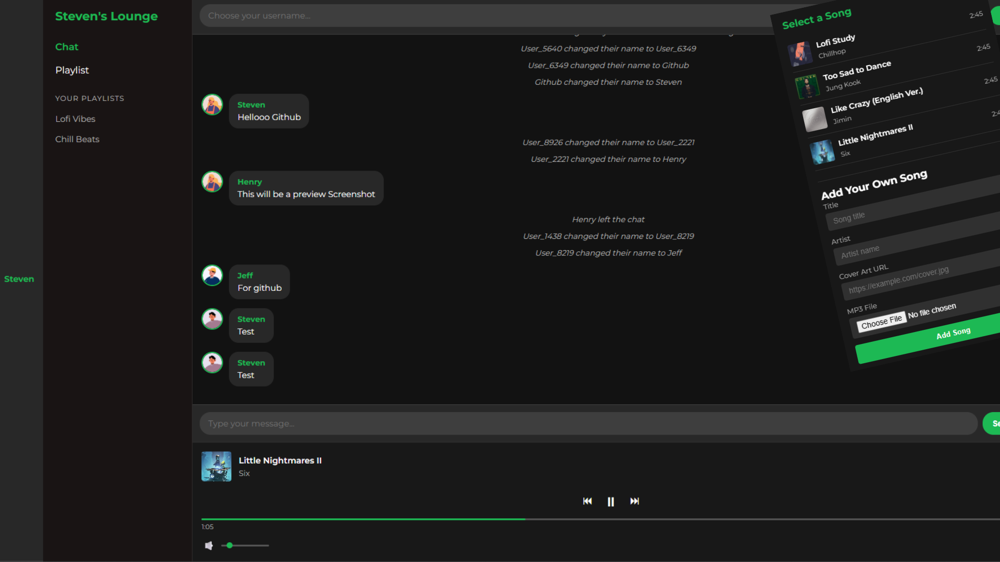

# 🎵 Music Lounge Chat

A real-time chat and music streaming platform built with **Flask**, **Socket.IO**, and modern **HTML/CSS/JavaScript**. Users can pick or upload their profile picture, change their username, and enjoy music in a shared lounge.

 

---

## 🌟 Features

- 🔥 **Real-time chat** using Flask-SocketIO
- 👤 **Dynamic usernames** that update instantly across UI and messages
- 🖼️ **Custom avatars** – select from presets or upload your own
- 📱 **Responsive design** for mobile and desktop
- 🎶 **Music player** with custom playlist, MP3 support, and now playing display
- 🎨 **Sleek dark UI** with smooth animations

---

## 🚀 Live Demo

🔗 [Live Site](https://music-lounge-flask.onrender.com/)

---

## ⚙️ Tech Stack

| Category    | Technology          |
|-------------|----------------------|
| Backend     | Python, Flask, Flask-SocketIO |
| Frontend    | HTML5, CSS3, JavaScript |
| Real-Time   | Socket.IO (via Flask-SocketIO) |
| Media       | HTML Audio API, Local MP3 files |
| Deployment  | Render / Vercel / Replit / Custom server |

---

## 📦 Setup Instructions

1. **Clone the repository**
   ```bash
   git clone https://github.com/your-username/music-lounge-chat.git
   cd music-lounge-chat
Create and activate a virtual environment

bash
Copy
python -m venv venv
source venv/bin/activate  # on Windows: venv\Scripts\activate
Install dependencies

bash
Copy
pip install -r requirements.txt
Run the Flask app

bash
Copy
python app.py
Visit the app

Open your browser and go to: http://localhost:5000
